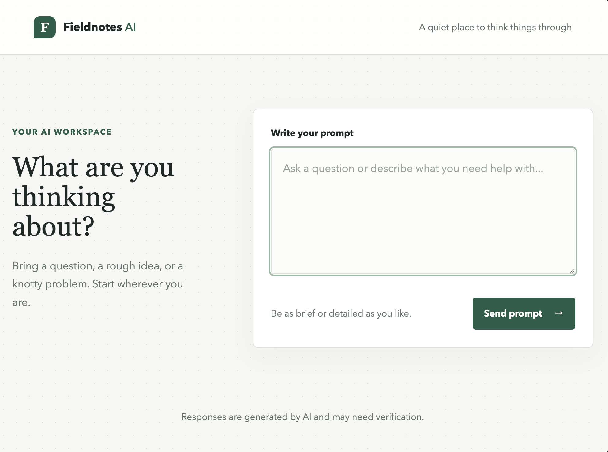
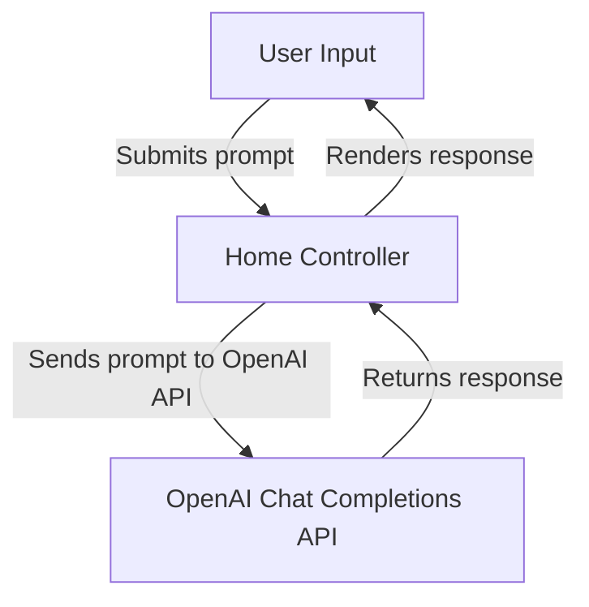
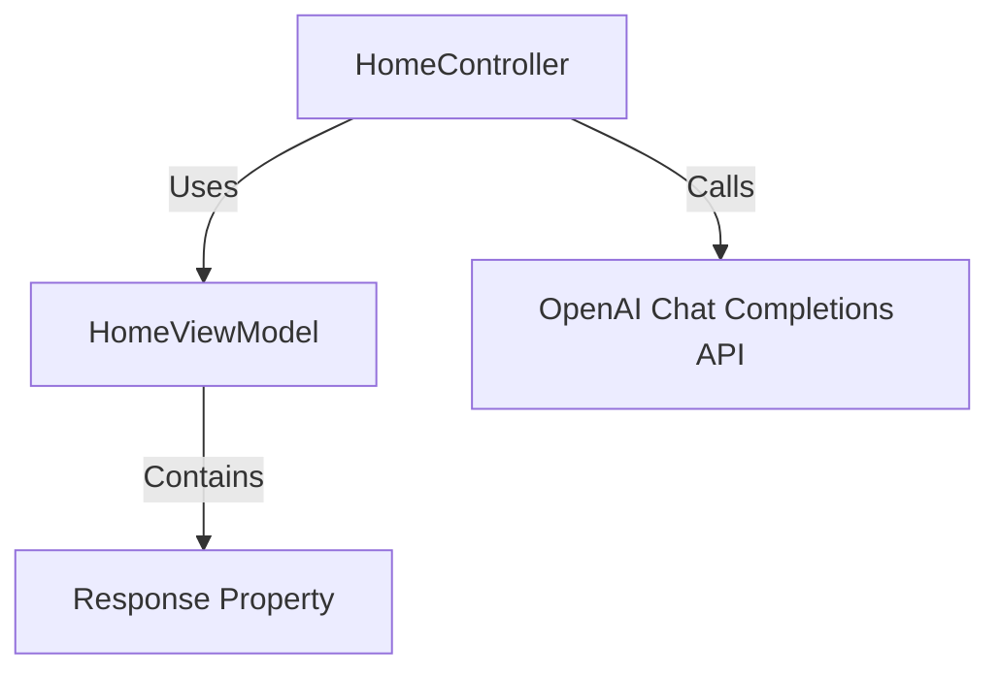

# MVC Agent

A small ASP.NET Core MVC app that sends  a prompt to the OpenAI Chat Completions API and displays the response.

## App
<!-- make image responsive and smaller -->  


## Requirements

- .NET 8 SDK
- An OpenAI API key with API access

## Configure and run

From this directory, set the API key in the same terminal where you will run the app:

```sh
export OPENAI_API_KEY="your-api-key"
dotnet run
```

Open the local URL printed by `dotnet run`. The default model is `gpt-4o-mini`; change `OpenAI:Model` in `appsettings.json` to use another model available to your account. Do not commit API keys to source control.

# Data Flow of Application

1. The user enters a prompt in the web interface, which is built in the file `Views/Home/Index.cshtml`. Key aspects of this chtml file include the form for user input and the display area for the response, shown:

```html
<form method="post" asp-action="Index">
    <input type="text" name="prompt" />
    <button type="submit">Submit</button>
</form>

<div>
    @if (Model?.Response != null)
    {
        <p>@Model.Response</p>
    }
</div>
```

2. The app sends the prompt to the OpenAI Chat Completions API. This is handled in the `HomeController` class, specifically in the `Index` action method, which takes the user input, constructs a request to the API, and awaits the response. Key aspects of this method include reading the prompt from the form, creating a `ChatCompletionRequest`, and calling the OpenAI API client to get the response, shown:


```csharp
[HttpPost]
public async Task<IActionResult> Index(string prompt)
{
    var request = new ChatCompletionRequest
    {
        Model = _configuration["OpenAI:Model"],
        Messages = new List<ChatMessage>
        {
            new ChatMessage { Role = "user", Content = prompt }
        }
    };

    var response = await _openAiClient.ChatCompletions.CreateCompletionAsync(request);
    var model = new HomeViewModel
    {
        Response = response.Choices.FirstOrDefault()?.Message.Content
    };
    return View(model);
}
```
3. The API returns a response. This response is captured in the `response` variable in the `Index` action method, and the content of the message is extracted and assigned to the `Response` property of the `HomeViewModel`. Key aspects include accessing the first choice from the response and safely retrieving the message content, shown:    

```csharp
var response = await _openAiClient.ChatCompletions.CreateCompletionAsync(request);
var model = new HomeViewModel
{
    Response = response.Choices.FirstOrDefault()?.Message.Content
};
```


4. The app displays the response to the user.    
This is done in the `Views/Home/Index.cshtml` file, where the `Response` property of the `HomeViewModel` is checked and rendered if it is not null, as shown in the earlier HTML snippet. Key aspects include the conditional rendering of the response and the use of the `Model` object to access the view model properties, shown:

```html
<div>
    @if (Model?.Response != null)
    {
        <p>@Model.Response</p>
    }
</div>
```
 
# Mermaid Diagrams

## Data Flow


## Object Relationship Diagram




## Tech Stack   

- .NET 7
- ASP.NET Core MVC
- OpenAI API
- C#
- HTML/CSS
- Mermaid.js        

